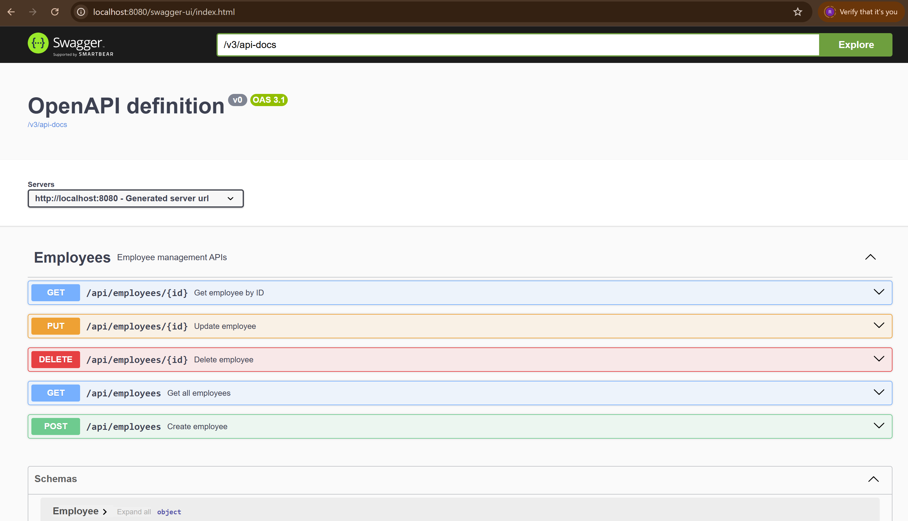

# Employee Management API

A RESTful employee management API built with Java and Spring Boot.

This project provides APIs to create, retrieve, update, and delete employee records, with input validation, exception handling, automated tests, and OpenAPI documentation.

## Tech Stack

- Java 21
- Spring Boot 4.1.1
- Spring Data JPA
- PostgreSQL
- Maven
- JUnit 5
- Mockito
- Spring MVC Test
- OpenAPI / Swagger


## Features

- Create employees
- Retrieve all employees
- Retrieve an employee by ID
- Update employee details
- Delete employees
- Search and filter support through the frontend
- Input validation
- Global exception handling
- Standard HTTP status codes
- Swagger / OpenAPI documentation
- Unit and controller tests

## API Endpoints

| Method | Endpoint | Description |
|---|---|---|
| GET | `/api/employees` | Get all employees |
| GET | `/api/employees/{id}` | Get an employee by ID |
| POST | `/api/employees` | Create a new employee |
| PUT | `/api/employees/{id}` | Update an employee |
| DELETE | `/api/employees/{id}` | Delete an employee |

## Validation and Error Handling

The API validates employee input before processing requests.

Validation includes:

- Name is required
- Email is required and must be a valid email address
- Email addresses must be unique

The application also provides centralized exception handling for:

- Resource not found (`404 Not Found`)
- Validation failures (`400 Bad Request`)

## API Documentation

The API is documented using OpenAPI and Swagger UI.

Once the application is running, Swagger UI is available at:

`http://localhost:8080/swagger-ui/index.html`

## Database Setup

This project uses PostgreSQL.

Create a database named:

```text
employee_management
```

Configure the database connection in:

``` text
src/main/resources/application.properties
```
Example:
``` text
spring.datasource.url=jdbc:postgresql://localhost:5432/employee_management
spring.datasource.username=postgres
spring.datasource.password=YOUR_POSTGRES_PASSWORD

```

## Running the Application

### Prerequisites

Make sure the following are installed:

- Java 21
- Maven
- PostgreSQL

### Start the application

Run the following command from the project root:

```bash
./mvnw spring-boot:run
```
On Windows, you can use:

```bash
mvnw.cmd spring-boot:run
```

The API will start on:

http://localhost:8080

Swagger UI:

http://localhost:8080/swagger-ui/index.html


## Testing

The project includes unit tests and controller tests covering the main employee management functionality.

Run all tests with:

```bash
mvnw.cmd test
```
The test suite covers:

Employee creation
Retrieving employees
Updating employees
Deleting employees
Resource-not-found handling
Request validation
HTTP response status codes

Current test suite: 15 tests

## Project Structure

```text
src
├── main
│   ├── java
│   │   └── com.freelance.employeemanagement
│   │       ├── config
│   │       ├── employee
│   │       ├── exception
│   │       └── EmployeeManagementApiApplication.java
│   └── resources
│       └── application.properties
└── test
    └── java
        └── com.freelance.employeemanagement
            ├── employee
            └── EmployeeManagementApiApplicationTests.java
The application follows a layered structure with separate components for configuration, employee management, and exception handling.
```

## Future Improvements

Potential enhancements for future versions include:

- Authentication and authorization
- Pagination and sorting
- Advanced employee search and filtering
- Improved duplicate-email error handling
- Docker support
- CI/CD pipeline
- Cloud deployment

## Screenshots

### Swagger API Documentation

